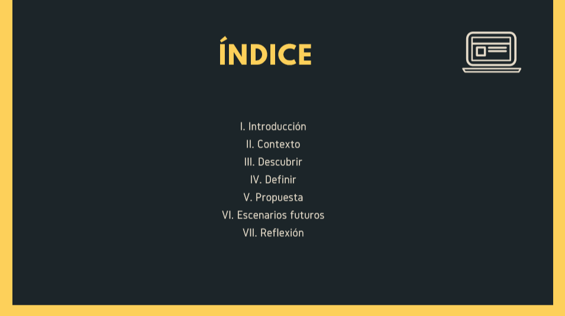
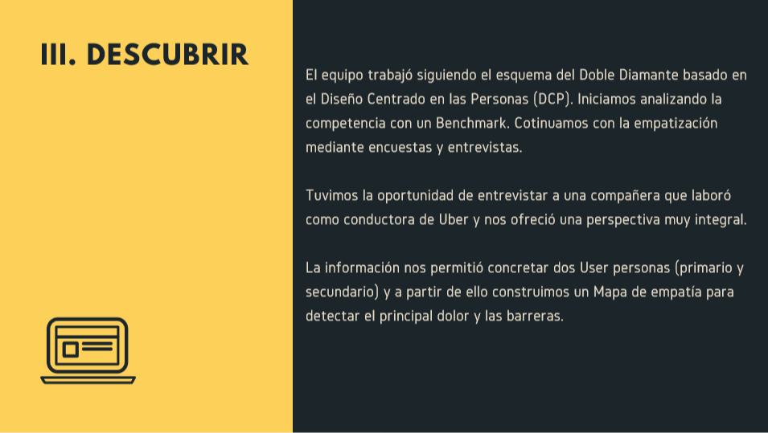
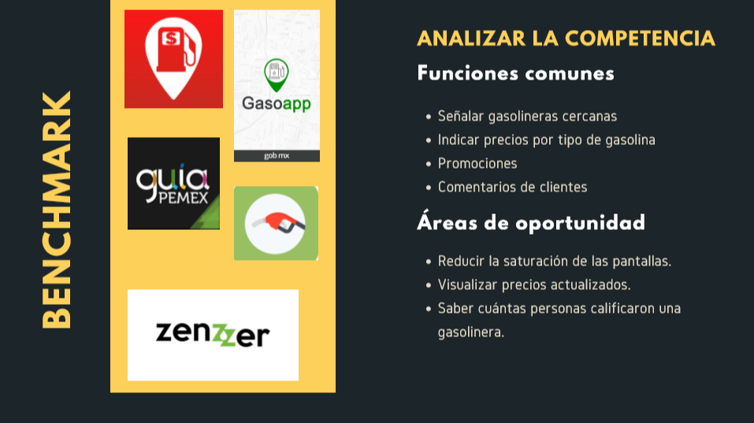
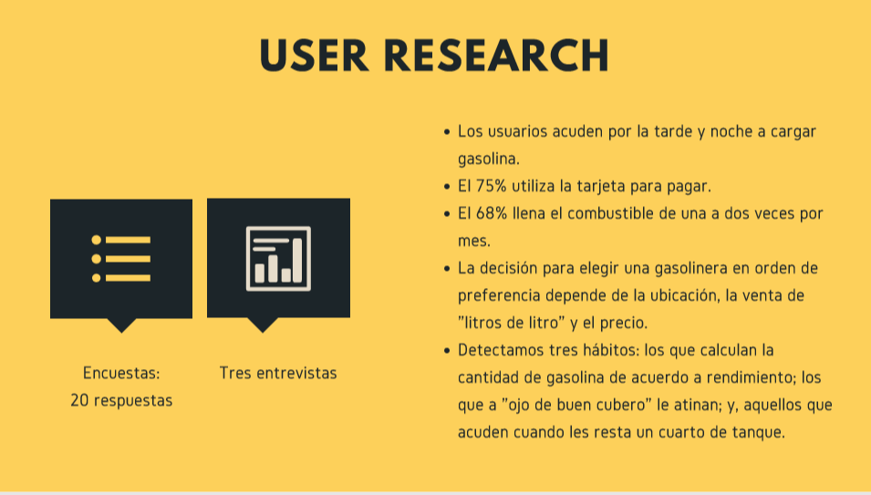
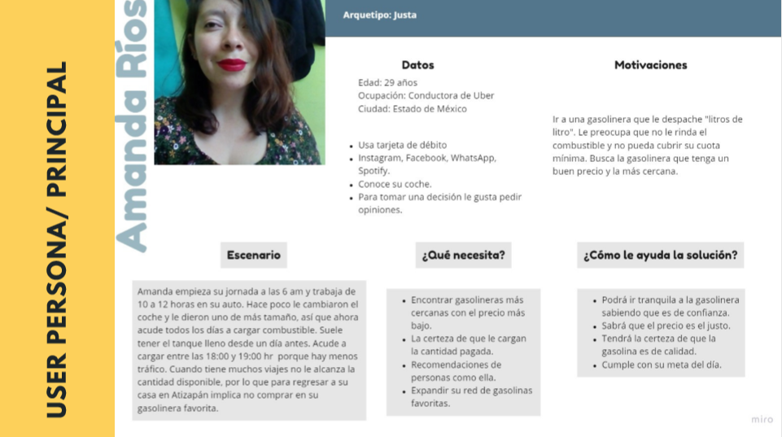
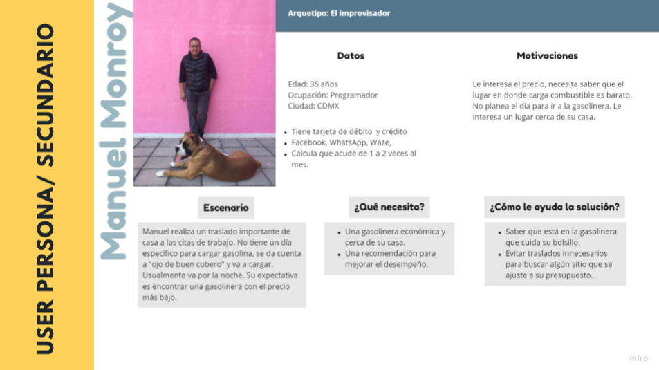
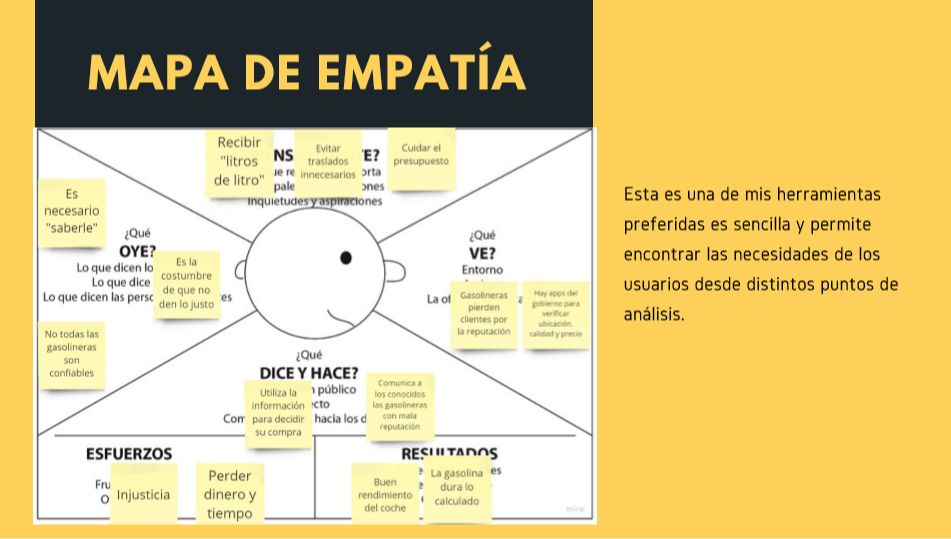
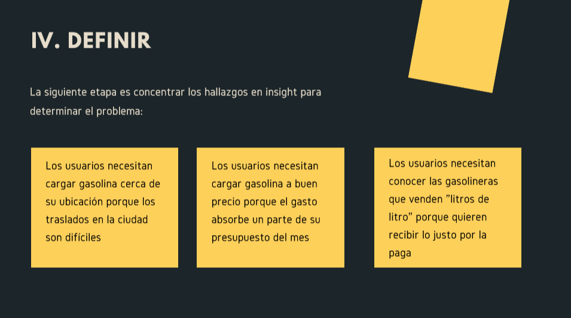
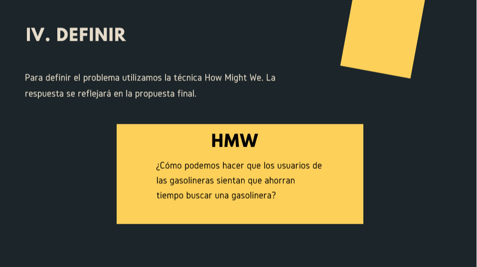
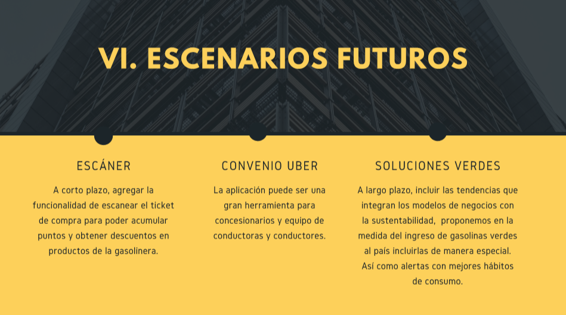

# Go-Gas 2019
## Índice del proyecto de pagina

- [Descripción](#Descripción)
- [Comenzando](#Comenzando)
- [Pre-requisitos](#Pre-requisitos)
- [Instalación](#Instalación)
- [Construido con](#Construido-con)
- [Contribuyendo](#Contribuyendo)
- [Versionando](#Versionando)
- [Development server](#Develpment-server)
- [Agradecimientos](#Agradecimientos)
- [Code scaffolding](#Code-scaffolding)

## Descripción

# GO-GAS 

 
 - 
 - 
  - 
   - 
    - 
     - 
      - 
       - 
        - 
         - 
          - 
           - 
            - 
             - 

  

## Comenzando

Este proyecto toma los datos de un servicio , se utilizo el editor de texto de Visual Studio Code, con en lenguaje JavaScript, sobre el marcador de texto HTML, con el lenguaje de diseño grafico CSS, usando bootstrap ; el repositorio original se creo en git hub. A continuación las especificaciones técnicas

## Pre requisitos

Para poder descargar y usar este repositorio se necesita tener:

- un editor de texto.
- una shell para interpretar líneas de comando 
- git

## Instalación 📦

Para poder usar el repositorio necesitas forquearlo (dando click donde dice fork) y despues clonarlo en la consola con :git clone + el url del repo.

## Construido con 
- Angular
- Herramietas de google docs
- GoogleMaps 
- Firebase
- TypeScript
- Javascript
- Bootstrap
- HTML
- CSS

## Contribuyendo

Se agradecerá toda contribución y comentarios a este proyecto.
Para ello necesitas:

- Tener una cuenta en git.

- Haciendo fork en el repositorio de git, clonandolo de manera local en tu pc.

- Crear un repositorio en la cuenta del Github 

## Versionando

El sistema de control de versiones en este caso es el de git que permite descargar el repositorio y las actualizaciones a traves de el comando git pull. Se recomienda numerar el versionado por si se quiere tener mayor orden sobre lo que se hace.

## Licencia

- Codigo abierto
- Datos tomados de https://datos.gob.mx/busca/dataset/estaciones-de-servicio-gasolineras-y-precios-finales-de-gasolina-y-diesel
- This project was generated with [Angular CLI](https://github.com/angular/angular-cli) version 7.3.8.

## Development server

Run `ng serve` for a dev server. Navigate to `http://localhost:4200/`. The app will automatically reload if you change any of the source files.

## Code scaffolding

Run `ng generate component component-name` to generate a new component. You can also use `ng generate directive|pipe|service|class|guard|interface|enum|module`.

